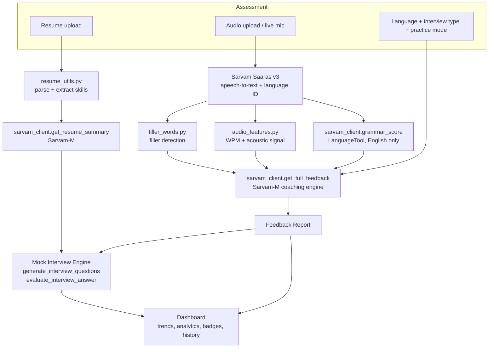

# Architecture

This document covers three things: how data flows through the system, the backend module/function reference (there is no REST API — see [Current Status &amp; Known Gaps](./README.md#current-status--known-gaps)), and the frontend component tree and state model.

---

## 1. System overview



**Design principle:** deterministic signals (filler count, WPM, LanguageTool grammar) are computed in plain Python and handed to the LLM as *context*, not left for the LLM to estimate from scratch. The LLM's job is synthesis and judgment — turning "14 filler words, 148 WPM, grammar 79/100" into a coherent coaching narrative — not arithmetic.

---

## 2. Backend module reference

The backend is a single Streamlit app (`backend/app.py`) plus five support modules. There is no HTTP layer — everything is a direct Python function call within one process. This section documents those function signatures as the de facto internal API.

### `sarvam_client.py` — All Sarvam AI calls

Every function in this file automatically falls back to realistic mock data if `SARVAM_API_KEY` isn't configured (checked via `is_live()`), so the rest of the app never needs to know whether it's talking to the real API or not.

| Function                         | Signature                                                                                                                                   | Purpose                                                                                                                                                                                              |
| -------------------------------- | ------------------------------------------------------------------------------------------------------------------------------------------- | ---------------------------------------------------------------------------------------------------------------------------------------------------------------------------------------------------- |
| `is_live()`                    | `() -> bool`                                                                                                                              | True if a real Sarvam client can be constructed (key present + SDK installed).                                                                                                                       |
| `transcribe_audio`             | `(uploaded_file=None, language_mode="auto", manual_language="English", force_mock=False) -> dict`                                         | Calls Sarvam**Saaras v3** (`speech_to_text.transcribe`). Returns `{"transcript": str, "detected_language": str, "words": [...]}`. Auto-detects language unless `language_mode="manual"`. |
| `grammar_score`                | `(transcript, language) -> dict \| None`                                                                                                   | Real, rule-based grammar check via`language_tool_python`, English only. Returns `None` for other languages so the LLM feedback call estimates grammar instead.                                   |
| `get_full_feedback`            | `(transcript, filler_stats, interview_type, practice_mode, language, wpm=None, pace_hint=None, acoustic=None, grammar_hint=None) -> dict` | The main coaching call, via Sarvam-M (`chat.completions`). Returns the full feedback schema (see below). Deterministic/acoustic values passed in are treated as ground truth by the prompt.        |
| `get_resume_summary`           | `(resume_text, fallback_skills=None) -> dict`                                                                                             | Sarvam-M call that returns`{"headline", "experience_years", "top_skills", "summary", "suggested_focus_areas"}`.                                                                                    |
| `generate_interview_questions` | `(interview_type, resume_summary=None, n=4) -> list[str]`                                                                                 | Sarvam-M call; asks for resume-specific questions when a resume summary is supplied, falls back to`mock_interview.get_static_questions` on any failure.                                            |
| `evaluate_interview_answer`    | `(question, answer_transcript, interview_type) -> dict`                                                                                   | Returns`{"score": int, "feedback": str, "follow_up_question": str}`.                                                                                                                               |

**`get_full_feedback` response schema:**

```json
{
  "fluency": 82,
  "grammar": 79,
  "pronunciation": 75,
  "confidence": 68,
  "emotion": "Calm and steady",
  "pace": 74,
  "pace_note": "Slightly fast",
  "overall": 76,
  "summary": "Solid answer -- a little polish on delivery.",
  "public_speaking": {
    "storytelling": 78,
    "audience_engagement": 70,
    "presentation_flow": 74
  },
  "coaching_plan": {
    "focus_area": "Cutting filler words before technical terms",
    "notes": ["...", "...", "..."],
    "drills": [{"title": "...", "desc": "..."}]
  },
  "fillers": 14
}
```

### `filler_words.py` — Deterministic filler detection

| Function                 | Signature                                       | Purpose                                                                                                            |
| ------------------------ | ----------------------------------------------- | ------------------------------------------------------------------------------------------------------------------ |
| `analyze_fillers`      | `(transcript, duration_seconds=None) -> dict` | Regex word-boundary match against`FILLER_WORDS`. Returns `{"hits": [...], "count": int, "per_minute": float}`. |
| `highlight_transcript` | `(transcript, hits) -> list[tuple]`           | Splits the transcript into`(text, is_filler)` chunks for rendering.                                              |
| `word_count`           | `(transcript) -> int`                         | Plain whitespace word count.                                                                                       |

### `audio_features.py` — Pace, confidence, emotion

| Function                     | Signature                                                     | Purpose                                                                                                                                                                                                                                                                                                                           |
| ---------------------------- | ------------------------------------------------------------- | --------------------------------------------------------------------------------------------------------------------------------------------------------------------------------------------------------------------------------------------------------------------------------------------------------------------------------- |
| `get_audio_duration`       | `(uploaded_file) -> float \| None`                           | Via`mutagen`. Returns `None` if unavailable.                                                                                                                                                                                                                                                                                  |
| `compute_wpm`              | `(transcript_word_count, duration_seconds) -> float \| None` | Words per minute.                                                                                                                                                                                                                                                                                                                 |
| `pace_score_from_wpm`      | `(wpm, target_low=120, target_high=160) -> (int, str)`      | Maps WPM to a 0–100 score, peaking in the 120–160 WPM band.                                                                                                                                                                                                                                                                     |
| `analyze_acoustic_signals` | `(uploaded_file, filler_stats) -> dict`                     | Returns`{"confidence": int, "emotion": str, "source": "librosa" \| "heuristic"}`. Uses pitch/energy stability via `librosa` if installed and the file loads cleanly; otherwise derives a plausible score from the filler rate. **This is explicitly a heuristic, not a trained classifier** — see the module docstring. |

### `resume_utils.py` — Resume parsing

| Function                | Signature                      | Purpose                                                                                               |
| ----------------------- | ------------------------------ | ----------------------------------------------------------------------------------------------------- |
| `extract_resume_text` | `(uploaded_file) -> str`     | PDF via`pdfplumber`, DOCX via `python-docx`, else best-effort UTF-8 decode.                       |
| `extract_skills`      | `(resume_text) -> list[str]` | Deterministic keyword match against`SKILL_KEYWORDS` — a fast baseline independent of the LLM call. |

### `mock_interview.py` — Static question bank

| Function                 | Signature                              | Purpose                                                                          |
| ------------------------ | -------------------------------------- | -------------------------------------------------------------------------------- |
| `get_static_questions` | `(interview_type, n=4) -> list[str]` | Fallback / non-resume question source for HR, Technical, Behavioral, Managerial. |

---

## 3. External API: Sarvam AI

CommCoach calls two Sarvam AI capabilities directly (via the `sarvamai` Python SDK):

| Capability                 | SDK call                                                                                                  | Used for                                                                        |
| -------------------------- | --------------------------------------------------------------------------------------------------------- | ------------------------------------------------------------------------------- |
| Speech-to-text (Saaras v3) | `client.speech_to_text.transcribe(file=..., model="saaras:v3", mode="transcribe", language=<optional>)` | Transcription + automatic language detection                                    |
| Chat completion (Sarvam-M) | `client.chat.completions(model="sarvam-m", messages=[...], temperature=...)`                            | Coaching feedback, resume summarization, question generation, answer evaluation |

Authentication is a single subscription key, passed as `SarvamAI(api_subscription_key=key)`. See [Environment Variables](./README.md#environment-variables) for where that key comes from.

All four LLM-backed functions in `sarvam_client.py` (`get_full_feedback`, `get_resume_summary`, `generate_interview_questions`, `evaluate_interview_answer`) send a strict "return JSON only" system prompt and parse the response by locating the first `{` and last `}` — if parsing fails for any reason (malformed JSON, API error, no client configured), each function falls back to its own `_mock_*` function rather than raising, so a flaky response never crashes the app.

---

## 4. Frontend: component tree & state flow

`frontend/CommCoachApp.jsx` is a single-file React component (no external CSS framework — inline styles + design tokens). All state lives in the root `CommCoachApp` component and is passed down via props; there's no global state library.

### Page tree

```
CommCoachApp (root — owns all state)
├── Header
├── Stepper                    (4-step nav: Assessment / Feedback / Mock Interview / Dashboard)
├── AssessmentPage             (page 1)
│   └── ResumeUpload
├── FeedbackPage                (page 2)
│   ├── ScoreRing
│   └── MetricCard (×8, +3 more when Public Speaking mode)
├── MockInterviewPage          (page 3)
│   └── ScoreRing
└── DashboardPage              (page 4)
    └── StatCard (×6)
```

Shared building blocks used across pages: `Waveform` (the signature animated visual), `Label`, `ChipRow`, `Pill`, `SectionTitle`.

### Root state (`CommCoachApp`)

| State                 | Shape                                                            | Owned by / passed to                                                                                        |
| --------------------- | ---------------------------------------------------------------- | ----------------------------------------------------------------------------------------------------------- |
| `page`              | `1 \| 2 \| 3 \| 4`                                                | Drives the router at the bottom of`CommCoachApp`; `Stepper` can jump to any page directly.              |
| `resume`            | `{fileName, headline, summary, skills[]} \| null`               | Set by`ResumeUpload` inside `AssessmentPage`; read by `MockInterviewPage` for resume-aware questions. |
| `history`           | `Session[]` (seeded with `MOCK_HISTORY`)                     | Appended to on every completed Assessment; read by`DashboardPage` for trend charts.                       |
| `interviewSessions` | `InterviewSummary[]` (seeded with `MOCK_INTERVIEW_SESSIONS`) | Appended to when a Mock Interview run finishes; read by`DashboardPage` for interview analytics.           |
| `currentSession`    | Full feedback object for the most recent Assessment              | Read by`FeedbackPage`; also seeds `MockInterviewPage`'s default interview type.                         |

### Data flow for one Assessment → Feedback cycle

1. `AssessmentPage` collects language mode, interview type, practice mode, and audio (upload / live mic / sample).
2. On submit, a simulated multi-stage progress pipeline runs (`setInterval`-driven), ending in `onDone({ language, interviewType, practiceMode })`.
3. `CommCoachApp.handleAssessmentDone` builds a feedback object from `buildMockFeedback(practiceMode)`, stores it as `currentSession`, appends a row to `history`, and sets `page = 2`.
4. `FeedbackPage` renders `currentSession`, with `"Start mock interview"` → `page = 3`, `"View dashboard"` → `page = 4`.
5. `MockInterviewPage` runs its own local Q&A loop (own state: `questions`, `idx`, `log`), then calls `onFinish(summary)` → `CommCoachApp.handleInterviewFinish` appends to `interviewSessions` and sets `page = 4`.

### Live microphone recording

`AssessmentPage` uses the browser `MediaRecorder` API directly (`navigator.mediaDevices.getUserMedia({ audio: true })`). Recorded audio currently feeds into the same simulated analysis pipeline as file uploads/samples — the `Blob` is captured correctly but not sent anywhere yet. Wiring it to a real backend means POSTing that `Blob` instead of calling the mock `startUpload()`.

**Note the ref/state split for the recording timer:** the elapsed-seconds *display* uses React state (`recordSeconds`) so it re-renders each second, but the `MediaRecorder.onstop` handler reads from a parallel ref (`recordSecondsRef`) instead of the state variable — reading `recordSeconds` there would close over its value at recording-start time (0), not the live count. If you touch this code, keep both in sync.

---

## 5. Design system (frontend)

| Token        | Value         | Used for                       |
| ------------ | ------------- | ------------------------------ |
| Background   | `#14122B`   | App background                 |
| Card         | `#1E1B42`   | Card surfaces                  |
| Coral        | `#FF5533`   | Fluency, primary actions       |
| Yellow       | `#FFD23F`   | Grammar                        |
| Mint         | `#33E6A0`   | Pronunciation, positive states |
| Purple       | `#9C7BFF`   | Confidence                     |
| Display font | Space Grotesk | Headings                       |
| Body font    | Inter         | Body text                      |
| Mono font    | Space Mono    | Scores, data, timestamps       |

The animated waveform (`Waveform` component) is the recurring signature visual — used as the upload hero, the step connector, the recording indicator, and mini icons in the session history list.
