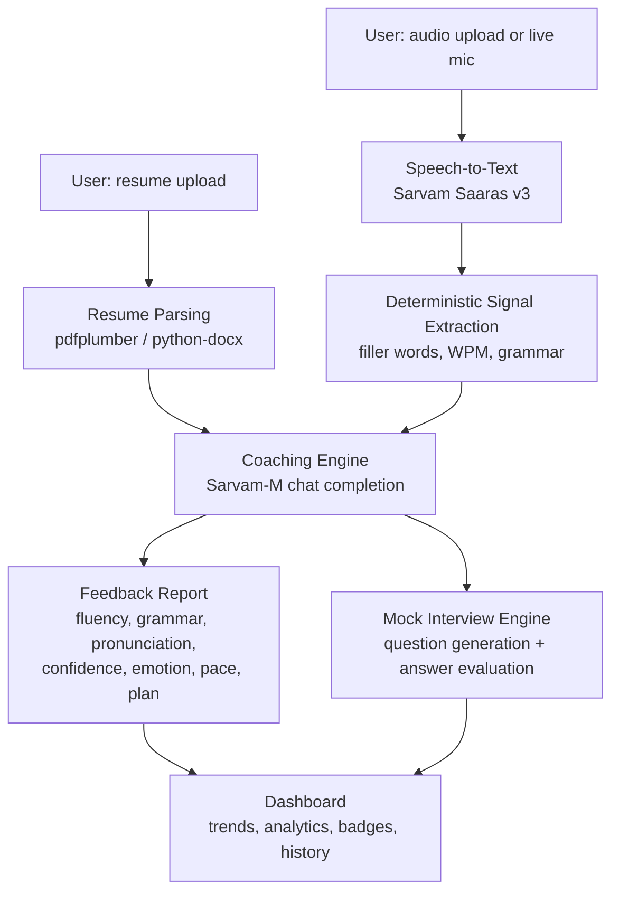

# CommCoach AI

**AI-powered communication and interview coaching.** Upload a recording (or speak live), and CommCoach breaks down your fluency, grammar, pronunciation, confidence, emotion, and pace — then coaches you on what to fix, generates resume-aware mock interview questions, and tracks your progress over time.

Built for a capstone project, powered by [Sarvam AI](https://sarvam.ai) for speech-to-text and coaching intelligence, with first-class support for English and Indian languages (Hindi, Kannada, Tamil, Telugu, and code-mixed "Hinglish" speech).

> **Status:** Backend (Streamlit) is a working prototype with automatic mock-data fallback. Frontend (React) is a standalone UI prototype with mock data. **The two are not yet wired together** — see [Current Status & Known Gaps](#current-status--known-gaps) before you start contributing.

---

## Table of contents

- [Features](#features)
- [Architecture overview](#architecture-overview)
- [Project structure](#project-structure)
- [Quickstart](#quickstart)
- [Environment variables](#environment-variables)
- [Current status & known gaps](#current-status--known-gaps)
- [Further documentation](#further-documentation)

---

## Features

**Assessment**
- Audio upload or **live microphone recording** (frontend)
- Automatic spoken-language detection (English + 5 Indian languages/dialects) via Sarvam Saaras, or manual override
- Resume upload (PDF / DOCX / TXT) with skill extraction and an AI-generated summary
- Practice mode selection: Mock Interview, Public Speaking, Presentation Practice, Resume-Based Interview
- Interview type selection: HR, Technical, Behavioural, Managerial

**Feedback**
- Fluency, Grammar, Pronunciation, Confidence, Emotion, Pace (WPM), and Filler-word scoring
- Real, deterministic filler-word counting (not LLM-guessed)
- Real English grammar checking via LanguageTool, with LLM-estimated grammar for other languages
- Speaking pace computed from actual audio duration + transcript length
- Optional acoustic confidence/emotion signal (librosa pitch & energy analysis), with a graceful heuristic fallback
- Public Speaking Analysis (storytelling, audience engagement, presentation flow) for relevant practice modes
- Personalized Coaching Plan: a focus area, specific notes, and practice drills
- Full transcript with filler words highlighted inline

**Mock Interview**
- HR / Technical / Behavioural / Managerial question banks
- Resume-aware question generation (asks about your actual listed skills)
- Per-answer scoring, feedback, and an auto-generated follow-up question
- End-of-interview summary with a full Q&A breakdown

**Dashboard**
- KPI cards (sessions, average scores, mock interviews completed, etc.)
- Progress trend chart with toggleable metrics
- Confidence trend chart
- Interview analytics (average score by interview type)
- Achievement/badge system
- Full session history

---

## Architecture overview



CommCoach follows a **signal extraction + LLM synthesis** pattern rather than asking a single model to do everything:

1. **Deterministic layer** — filler-word counts, words-per-minute, and (for English) grammar-checker output are computed directly in Python. These are exact and reproducible.
2. **Acoustic layer (optional)** — if `librosa` is installed, pitch and energy stability are analyzed to produce a confidence/emotion signal; otherwise a heuristic derived from the filler-word rate is used instead. Either way this is framed as a supporting signal, not a certified score.
3. **LLM layer** — Sarvam-M receives the transcript *plus* the already-computed deterministic/acoustic signals as context, and is instructed to stay consistent with them rather than re-guessing. It's responsible for the qualitative parts: fluency/pronunciation estimation, the coaching plan, mock interview questions, and answer evaluation.

See [`ARCHITECTURE.md`](./ARCHITECTURE.md) for the full module and component breakdown.

---

## Project structure

```
commcoach/
├── backend/                    # Streamlit application
│   ├── app.py                  # Main app — 4-step workflow & page router
│   ├── sarvam_client.py        # All Sarvam AI calls (STT, chat) + mock fallback
│   ├── filler_words.py         # Deterministic filler-word detection
│   ├── audio_features.py       # WPM + acoustic confidence/emotion signal
│   ├── resume_utils.py         # Resume parsing (PDF/DOCX) + skill extraction
│   ├── mock_interview.py       # Static question bank (fallback)
│   ├── requirements.txt
│   └── .streamlit/
│       └── secrets.toml.example
│
├── frontend/                   # React UI prototype (mock data, not yet wired to backend)
│   └── CommCoachApp.jsx        # Single-file 4-page app: Assessment → Feedback → Mock Interview → Dashboard
│
└── docs/                       # This documentation set
    ├── README.md
    ├── ARCHITECTURE.md
    ├── CONTRIBUTING.md
    ├── CODE_OF_CONDUCT.md
    └── .env.example
```

---

## Quickstart

### Prerequisites

- Python 3.10+
- A [Sarvam AI](https://dashboard.sarvam.ai/) API key (optional — the app runs in demo mode without one)
- *(Optional, for full acoustic + grammar features)* a working C/Fortran build toolchain for `librosa`'s dependencies, and a local Java runtime for `language_tool_python`

### 1. Clone and install

```bash
git clone <your-fork-url> commcoach
cd commcoach/backend
pip install -r requirements.txt
```

If you don't need real acoustic confidence/emotion detection or real grammar checking yet, you can skip the heavier optional dependencies:

```bash
pip install streamlit pandas altair sarvamai mutagen pdfplumber python-docx
```
The app detects missing optional packages at runtime and falls back to heuristics automatically — nothing crashes.

### 2. Configure your API key (optional)

Copy the secrets template and fill in your key:

```bash
cp .streamlit/secrets.toml.example .streamlit/secrets.toml
```

```toml
# .streamlit/secrets.toml
SARVAM_API_KEY = "your-sarvam-api-key-here"
```

Alternatively, export it as an environment variable — `sarvam_client.py` checks both:

```bash
export SARVAM_API_KEY="your-sarvam-api-key-here"
```

**No key configured?** The app runs automatically in demo mode: every feature works end-to-end using realistic mock data, so you can develop the UI and workflow without burning API credits.

### 3. Run it

```bash
streamlit run app.py
```

Streamlit will open the app at `http://localhost:8501`.

### 4. (Frontend prototype) Run the React UI

The React file in `frontend/CommCoachApp.jsx` was built as a single-file component (Tailwind-free, inline-styled, using `recharts` and `lucide-react`) and is not yet scaffolded as a standalone project. To run it locally:

```bash
npm create vite@latest commcoach-frontend -- --template react
cd commcoach-frontend
npm install recharts lucide-react
# copy CommCoachApp.jsx into src/, import and render it from src/App.jsx
npm run dev
```

---

## Environment variables

| Variable | Required? | Description |
|---|---|---|
| `SARVAM_API_KEY` | No — falls back to demo/mock mode if unset | Your Sarvam AI subscription key. Get one at [dashboard.sarvam.ai](https://dashboard.sarvam.ai/). Read from `st.secrets` or the environment. |

See [`.env.example`](./.env.example) for a copy-pasteable template. (Streamlit prefers `.streamlit/secrets.toml` over `.env`, but `sarvam_client.get_api_key()` checks `os.environ` first, so a plain `.env` loaded via `python-dotenv` or your shell also works.)

---

## Current status & known gaps

Being upfront about this saves new contributors a lot of confusion:

- **There is no custom REST API server.** The backend is a monolithic Streamlit app that calls the Sarvam AI API directly from within `app.py` / `sarvam_client.py`. There are no internal HTTP routes to document — see [`ARCHITECTURE.md`](./ARCHITECTURE.md) for the internal *function-level* API instead.
- **Frontend and backend are not connected.** `CommCoachApp.jsx` is a UI prototype with hardcoded mock data shaped to match the Streamlit backend's data structures, built for fast design iteration. Wiring them together means either (a) exposing the Python modules behind a small FastAPI wrapper for the React app to call, or (b) rebuilding the UI as Streamlit-native components. Neither has been started yet.
- **Pronunciation and emotion scores are heuristic**, not from a trained model. `audio_features.py` documents this clearly in its docstring — swapping in a real speech-emotion classifier (e.g. a wav2vec2-based model) is a contained change to that one file.
- **No automated tests yet.** See [`CONTRIBUTING.md`](./CONTRIBUTING.md) for how we'd like tests added going forward.
- **Session data doesn't persist.** Both the Streamlit app (`st.session_state`) and the React prototype (component state) lose all history on refresh. A persistence layer (SQLite, per the original architecture blueprint) hasn't been built yet.

## Further documentation

- [`ARCHITECTURE.md`](./ARCHITECTURE.md) — module reference, external API calls, frontend component tree, state flow
- [`CONTRIBUTING.md`](./CONTRIBUTING.md) — branching, commit style, PR checklist
- [`CODE_OF_CONDUCT.md`](./CODE_OF_CONDUCT.md) — community standards
